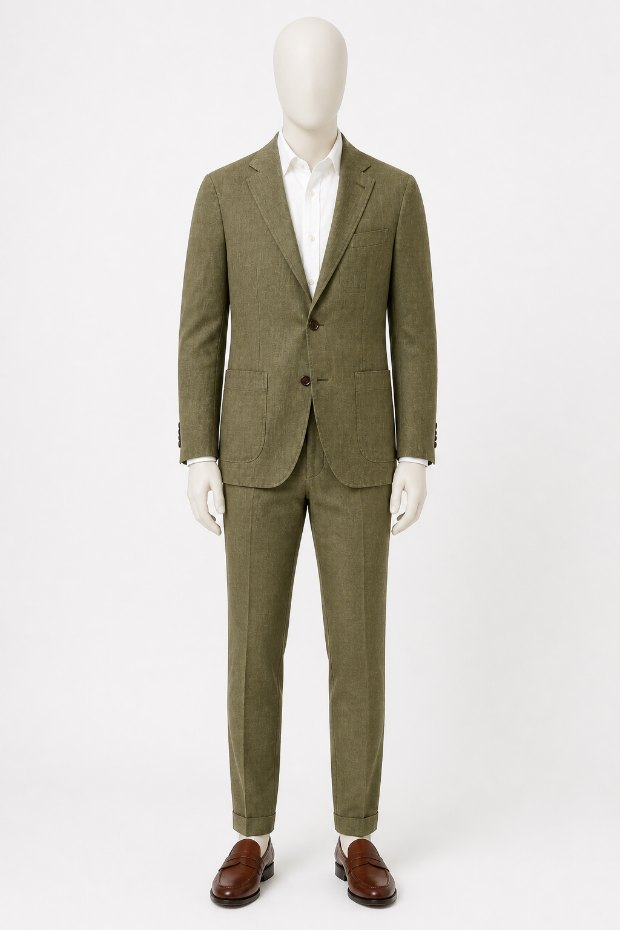
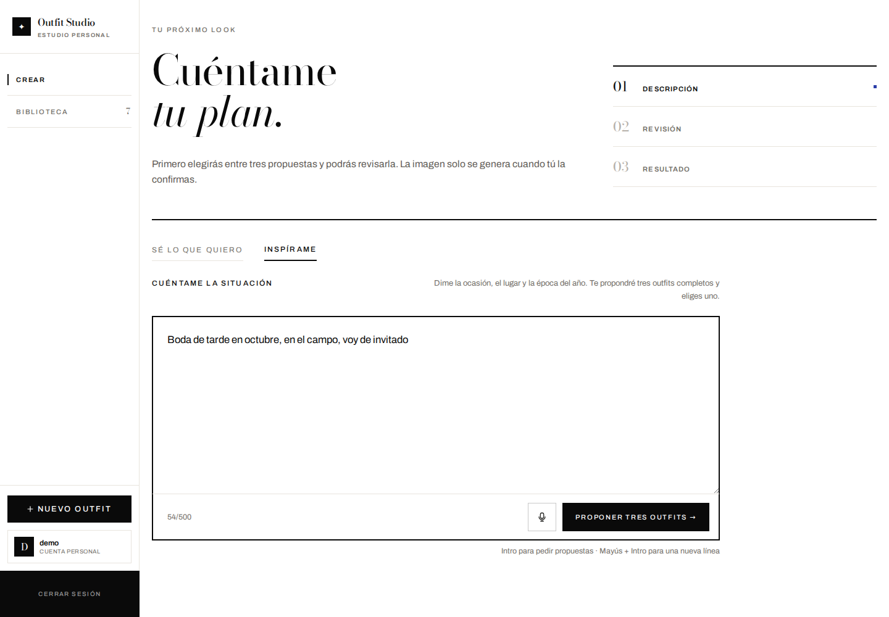
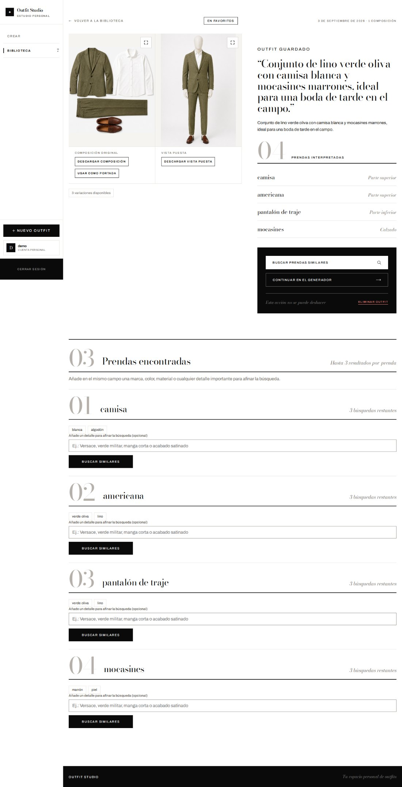
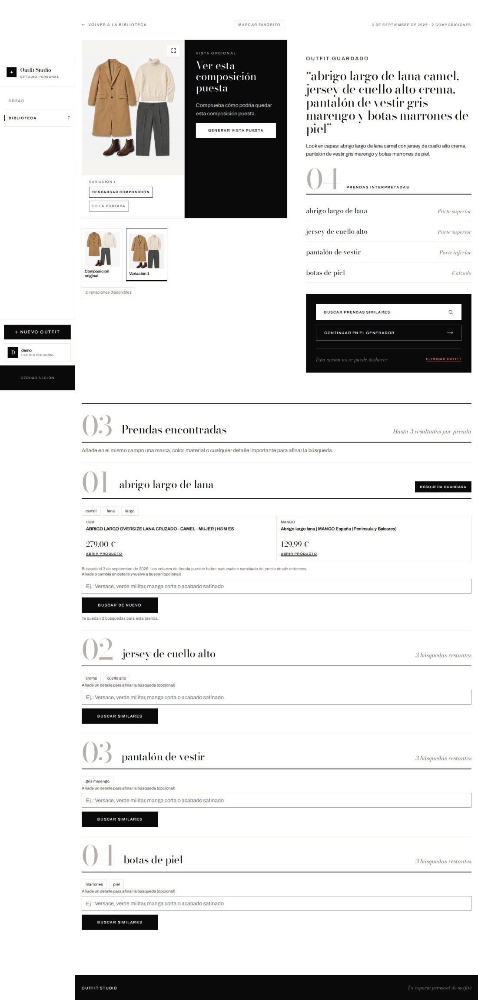
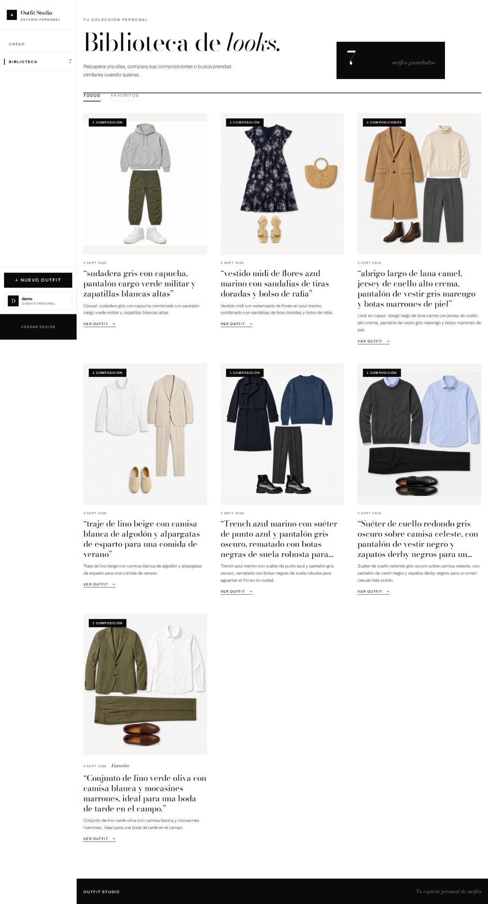

# Outfit Studio

**Le cuentas la situación, te propone tres outfits, eliges uno, lo ves antes de tenerlo,
y te dice dónde comprarlo.**

<p align="center">
  
  
</p>

<p align="center"><em>«Boda de tarde en octubre, en el campo, voy de invitado» → tres propuestas → la elegida, y su vista puesta.</em></p>

---

## El problema

Un generador de imágenes te obliga a saber ya lo que quieres. Escribes *«americana de
lino verde oliva con camisa blanca»* y te dibuja eso. Útil, pero deja fuera la pregunta
que la gente tiene de verdad: **«¿qué me pongo?»**.

Y hay un segundo problema, menos visible: cada una de esas imágenes cuesta dinero real.
Una aplicación que llama a un proveedor de pago puede arruinarte de tres maneras — un
doble clic que paga dos veces, un reintento automático tras un error que no se arregla
reintentando, o un coste registrado que nadie midió. Ninguna de las tres se ve en una
demo bonita.

Outfit Studio responde a la pregunta y, sobre todo, **no puede gastar sin permiso**.

## Qué hace

Dos vías sobre el mismo campo de texto, con un conmutador explícito. Sin detección
automática de intención: la aplicación nunca decide sola qué llamada de pago hace.

<p align="center">
  
</p>

**«Sé lo que quiero»** — describes el outfit y se analiza. El modelo extrae las prendas,
tú compruebas la interpretación, y solo entonces confirmas la imagen.

**«Inspírame»** — cuentas una situación y recibes **tres propuestas completas** entre las
que elegir. Elegir una no llama al proveedor: su extracción ya está guardada. Y elegir una
no cierra las otras dos, así que volver a por la segunda tampoco cuesta nada.

Desde ahí, todo lo demás: una **vista puesta** sobre maniquí neutro usando la composición
como referencia, y una **búsqueda de la prenda en tiendas reales** con enlaces verificados
contra las fuentes.

<p align="center">
  
</p>

La búsqueda devuelve tiendas y precios reales, con el enlace comprobado contra las
fuentes que el proveedor citó:

<p align="center">
  
</p>

Todo queda en una biblioteca donde eliges qué composición representa cada outfit y marcas
favoritos.

<p align="center">
  
</p>

## Tesis

**Un doble clic no puede pagar dos veces.** La reserva es una fila cuya clave primaria es
el `outfit_id`: la base de datos arbitra la carrera entre procesos, no el código. Una
segunda petición recibe `409` **antes** de construir el cliente de OpenAI.
→ [`outfit_operation_lease.py`](outfit-app-back/app/services/outfit_operation_lease.py)

**Una tarifa no verificada lanza una excepción en vez de estimar.** Registrar un coste
inventado corrompe la medición para siempre, así que se prefiere parar.
→ [`pricing.py`](outfit-app-back/app/pricing.py)

**Un 429 o un timeout nunca disparan un segundo modelo.** El fallback existe para salidas
que el código no puede usar, no para fallos operativos que el segundo modelo sufriría
igual.
→ [`openai_text.py`](outfit-app-back/app/services/openai_text.py)

**Nada se escribe en la base de datos hasta que el proveedor devuelve algo utilizable.**
Una imagen fallida no deja fila, ni coste fantasma, ni regeneración consumida.
→ [`outfit_service.py`](outfit-app-back/app/services/outfit_service.py)

Y en la búsqueda de prendas: **sin afiliación**. No se gana nada si compras, lo que
permite decirte que no compres. Solo se persisten URLs presentes en las fuentes, y una
ausencia real devuelve lista vacía en lugar de colar otra marca.

## Cómo está hecho

La pieza que sostiene todo es un único objeto, `OutfitExtraction`:

```
                    ┌──────────────────────┐        ┌─────────────────┐
  describes  ──────▶│                      │───────▶│ imagen          │
                    │   OutfitExtraction   │───────▶│ vista puesta    │
  cuentas    ──────▶│                      │───────▶│ búsqueda        │
  la situación      └──────────────────────┘        └─────────────────┘
```

Nada de lo que hay a la derecha vuelve a mirar tu texto:
`build_image_prompt(items, styling_notes_en)` no recibe la descripción, y la búsqueda
construye su consulta desde los atributos ya persistidos.

**El prompt de imagen se compone en código, no lo escribe el modelo.** Un A/B real
demostró que la prosa libre no garantizaba el orden corporal de las prendas. Con 1-3
piezas usa una silueta vertical; con 4, se produce una composición de accesorios.
Falla cerrado si le falta una frase visual.
→ [`image_prompt_builder.py`](outfit-app-back/app/prompts/image_prompt_builder.py)

**Un contrato JSON compartido** entre las dos aplicaciones: el backend comprueba que
serializa así y el frontend que lo consume así. Si alguien lo rompe, falla en los dos
lados a la vez.
→ [`contracts/outfit-detail.v1.json`](contracts/outfit-detail.v1.json)

**Stack.** FastAPI + SQLAlchemy + SQLite con migraciones Alembic en el backend; React +
TypeScript con `fetch` nativo y CSS plano en el frontend. Sin router, sin estado global,
sin framework de UI: la aplicación es una sola página y no los necesita.

## Números medidos

Cada coste de este repositorio salió de una ejecución real, calculado desde el `usage` que
devuelve el proveedor. El detalle completo, con lo que cada experimento probó **y lo que
no**, está en [`pricing.md`](outfit-app-back/pricing.md).

| Operación | Coste real medido |
|---|---|
| Tres propuestas a partir de una situación | $0,0015 – $0,0021 |
| Composición (`gpt-image-2`, calidad `low`) | $0,006 |
| Vista puesta sobre maniquí | ~$0,015 |
| Búsqueda de una prenda en tiendas | $0,012 – $0,024 |

La cuenta de las capturas de arriba —siete outfits, ocho composiciones, dos vistas puestas
y tres búsquedas— costó **$0,15 en total**.

## Probarlo

**El repositorio no incluye ninguna clave de OpenAI.** Para usarlo tienes que poner la
tuya, y el gasto es tuyo y solo tuyo. No hay ninguna instancia pública desplegada.

```bash
git clone <este-repositorio>
cd outfit-app

# Backend
cd outfit-app-back
python3.12 -m venv venv && source venv/bin/activate
python -m pip install -r requirements-dev.txt
cp .env.example .env          # y añade tu OPENAI_API_KEY
python -m alembic upgrade head
python -m uvicorn app.main:app --reload
```

```bash
# Frontend, en otra terminal
cd outfit-app-front
npm install && npm run dev
```

La interfaz queda en `http://127.0.0.1:5173`.

Las migraciones crean una cuenta de desarrollo local `admin` / `test`. **Existe solo en tu
base de datos**, no da acceso a nada de nadie, y su único efecto es mostrar la vista
técnica con prompts y costes; una cuenta creada desde la interfaz recibe la vista normal.

> Las capturas de búsqueda de prendas se tomaron el 3 de septiembre de 2026. Los enlaces
> de tienda y los precios pueden haber caducado o cambiado desde entonces.

## Calidad

```bash
cd outfit-app-back && venv/bin/python scripts/check.py    # 306 tests, ruff y formato
cd ../outfit-app-front && npm run check                   # 64 tests, oxlint y build
```

**Las comprobaciones locales y CI no hacen ni una llamada real a OpenAI.** La suite
arranca con una clave de pruebas, así que una llamada sin mockear fallaría en vez de
gastar, y los experimentos de pago tienen un modo de ensayo que ni siquiera llega a
construir el cliente.
→ [`tests/conftest.py`](outfit-app-back/tests/conftest.py)

La suite es grande a propósito: es lo que hace creíbles las cuatro invariantes de arriba.
Sin ella son una afirmación; con ella son una garantía.

## Documentación

El proyecto lleva un registro de cada decisión y su coste.

- [`contexto_proyecto.md`](outfit-app-back/contexto_proyecto.md) — arquitectura, contrato y
  el histórico de fases, cada una con lo que se decidió y por qué.
- [`pricing.md`](outfit-app-back/pricing.md) — tarifas verificadas y el resultado medido de
  cada experimento real, incluyendo lo que cada uno **no** demostró.
- [`OPTIMIZACION_PROMPTS_PRICING.md`](outfit-app-back/OPTIMIZACION_PROMPTS_PRICING.md) — el
  razonamiento de los experimentos visuales y de prompt.
- [`AUDITORIA_TECNICA.md`](outfit-app-back/AUDITORIA_TECNICA.md) — registro histórico de
  riesgos y cómo se resolvieron.

## Estructura

```text
outfit-app/
├── contracts/          # fixture JSON compartido entre backend y frontend
├── docs/               # capturas de esta documentación
├── outfit-app-back/    # API FastAPI, SQLite, migraciones y experimentos
└── outfit-app-front/   # interfaz React + TypeScript
```

Cada aplicación tiene su propio README con el detalle:
[backend](outfit-app-back/README.md) · [frontend](outfit-app-front/README.md)

## Alcance y límites

MVP personal.

- **Sin cuotas por usuario.** No hay despliegue público: cualquiera con acceso gastaría la clave del que lo desplegó.
- **Sin recuperación de contraseña, pagos ni administración avanzada.**
- **Español únicamente.** Heurística de validación y prompts en español.

## Licencia

[MIT](LICENSE). Puedes usarlo, modificarlo y distribuirlo; la única condición es
conservar el aviso de copyright.
